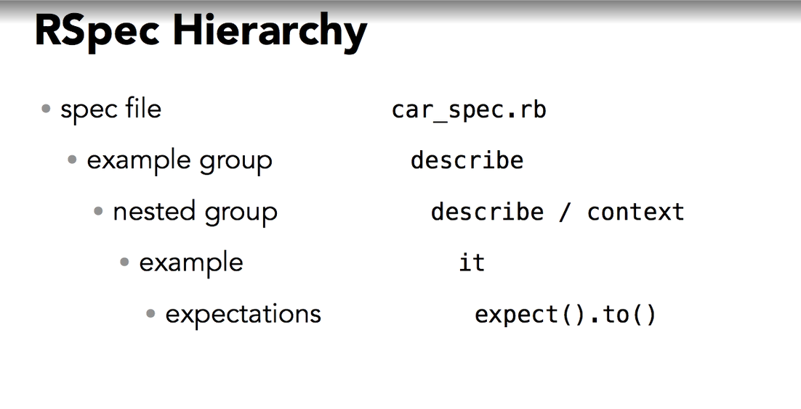

# RSpec installation
> gem install rspec
> rspec --version
> rspec --help

# RSpec Configuration
- there are some configurations for RSpec, below are the configurations, left hand side is the default one
```bash
--no-color, --color
--format progress, --format documentation
--no-profile, --profile
--no-fail-fast, --fail-fast
--order defined, --order random
```
- Global: ~/.rspec => for ur computer
- Project: ./.rspec => project wise
- Local: ./.rspec-local => my configuration (override any settings in global and project)

# Basic Syntax of RSpec
- we can use this command line to initialize rspec:
> rspec --init
- example of a unit test:
```bash
describe 'Car' do
    it "allows reading for :wheels" do
        # expectations
    end

    describe '.colors' do
        it "returns an array of color names" do
            # expectations
            c = ['blue', 'black', 'red', 'green']
            expect(Car.colors).to match_array(c)
        end
    end
    # or we can group with
    context '.colors' do
        it "returns an array of color names" do
            # expectations
        end
    end
end
```

# RSpec Hierarchy
- fundamental structure of RSpec


